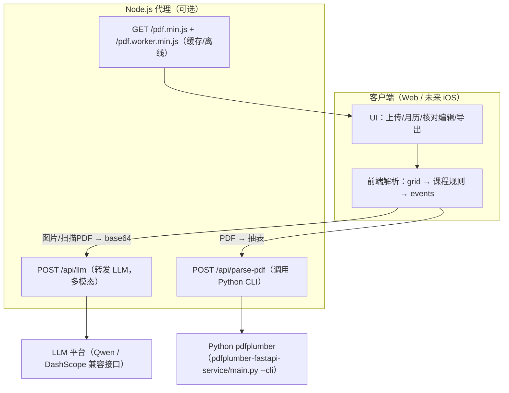

# 析课 - 智能课表生成工具

**析课** 是一个“解析 + 校对 + 生成”的课表工具：核心能力在前端（静态页/纯本地可运行），并可选接入 Node.js 代理与 Python（pdfplumber）来增强能力（LLM 多模态识别、PDF 抽表）。支持 Excel / PDF / 图片输入，输出月历视图，并支持 ICS日历文件 与离线 HTML 导出。适用于高校学生与教师，将复杂课表“解压缩”为直观日程。本工具不限定某特定学校或特定的教务系统，无需注册，无需手机号，无需输入个人信息，可直接使用。已部署于 yedaoai.com，具备操作简便、隐私友好、易推广复用等特点，可有效提升高校师生课表整理和教学日程管理效率。

## 🌟 开发背景

高校教务系统导出的课程表通常是以“一周”为循环单元的静态表格。然而在实际教学中，情况远比“一格一课”复杂：同一个时间单元格内可能堆叠了多门不同周次的课程，这些课程可能存在单双周轮换、各周次授课地点不固定等复杂情况。这意味着，一张看似清爽的 Excel 表格，实际上在每个细小的单元格中都高度“压缩”了多维度的、动态的教学时空信息。

对于广大师生而言，每次提取并解读课表信息的过程，实质上都是一次非常耗费精力的“大脑解压缩”过程。由于信息密度巨大，传统的手动解读方式不仅效率低下，而且极其容易出错（例如记错周次、走错教室等）。因此，开发一个能够对“压缩课表”进行自动解析（解压缩）并还原为直观日程的程序工具，不仅能极大程度上解放大脑逻辑，更是提升校园生活和工作效率的一项刚需。

## ✨ 主要功能
- 双阶段解析：先把课表还原为表格 grid，再对单元格做 正则 + LLM 语义解析。
- Excel/PDF/图片输入：Excel 表格上传；PDF 可用 pdfplumber 抽表；图片/扫描件走 Qwen-VL 视觉识别输出 grid。
- 扫描 PDF 兜底：若抽表失败，可将 PDF 第 1 页渲染成图片并调用 LLM 生成 grid。
- 月历视图：按月展示、颜色区分时段、周次提示。
- 课程核对/编辑：支持新增/修改/删除；时间冲突会阻止保存；同一时间同一地点仅提示用户确认（不强制合并）。
- 周次解析增强：支持 `1,3,5`、`1-16`、`第1-16周(单/双)`、`第2,4,6,...,16周` 等输入。
- 编辑日志：核对/编辑窗口底部日志按北京时间（GMT+8）显示。
- 导出与打印：ICS日历文件 导出、离线 HTML（含标题/Logo/网站链接；导出时优先内嵌 Logo 为 data URL，避免离线破图）、A4 打印优化。
- 个性化节次：分段联动的时间微调（1-4、5-8、9-10）。

## 🏗️ 系统架构

- 前端（核心）：HTML/CSS/JS 负责 UI、解析管线、月历渲染、核对编辑与导出。
- Node 代理（可选）：[server_debug.js](./server_debug.js) 提供认证、限流、LLM 转发与 PDF 解析入口。
- Python（可选）：[main.py](./pdfplumber-fastapi-service/main.py) 负责 pdfplumber 表格抽取；既可被 Node 以 CLI 方式调用，也可单独以 FastAPI 方式运行。

## 🧩 模块说明
- 前端入口：index.html、script.js、llm_parser.js、time_utils.js、style.css。
- Node 服务：server_debug.js，提供 /api/llm、/api/parse-pdf、/api/auth/login/logout、/healthz。
- Python 服务：pdfplumber-fastapi-service/ 目录，FastAPI + pdfplumber（同时支持 `main.py --cli`）。

---

## 🚀 快速开始
本工具已在阿里云部署，可直接访问 yedaoai.com 使用。

## 📖 使用指南
1. 上传课表（Excel 或 PDF）。
2. 设置开学日期与节次时间。
3. 点击生成日程，查看月历与课程列表。
4. 导出 ICS、打印或保存 HTML。

## 🛠️ 技术栈
- 前端：HTML5 / CSS3 / Vanilla JS + PDF.js
- 表格抽取：SheetJS (xlsx)、pdfplumber
- 视觉/语义：通义千问 Qwen（DashScope 兼容接口，Qwen-VL 用于图片/扫描件）
- 后端：Node.js（LLM 转发与 PDF 解析入口） + Python（pdfplumber，CLI/可选 FastAPI）

## 📄 许可证
本项目开源，仅供学习交流使用。
